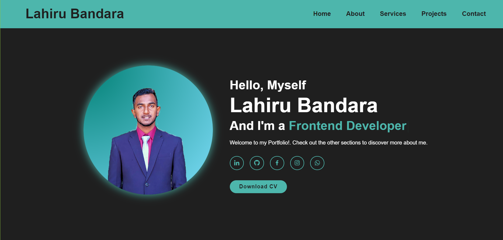

<h1 align="center">Hi 👋, I'm Lahiru Bandara 🇱🇰  </h1>

   
  

 

<h3 align="center"></h3>

<table align="center">
<tr border="none">
<td width="50%" align="left">

- 🌱 I’m currently learning **Python**,**React**, **UI/UX Design**

- 🧑‍🎓 I’m an Undergraduate at *EUSL*

- 👉 E-mail :- *lahiiru.dananjaya@gmail.com*

</td>
<td width="50%" align="center">
  
  
   
  Visit <a href="https://lahiru-dhananjaya.netlify.app/" target="_blank"> My Online Portfolio </a> to discover more about my journey!  
</td>
</tr>
</table>

---

<h3 align="center">Languages and Tools:</h3>

                

---

<h3 align="center">My Statistics:</h3>

<table align="center">
<tr border="none">
<td width="50%" align="center">

  
    
   
</td>
<td width="50%" align="center">

  

  </td>
</tr>
</table>
